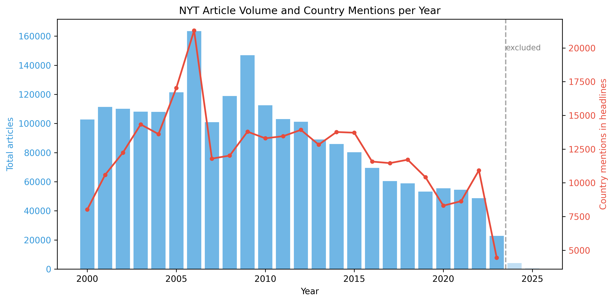

# Milestone 1

## Dataset

**Source**: [NYT Articles: 2.1M+ (2000-Present) Daily Updated](https://www.kaggle.com/datasets/aryansingh0909/nyt-articles-21m-2000-present)

The New York Times Articles dataset from Kaggle contains **2.2 million articles** published between 2000 and 2025. The dataset is a single 4.3GB CSV with 20 columns including `headline`, `abstract`, `keywords` (JSON array with glocations, subjects, persons), `pub_date`, `section_name`, `print_section`, `print_page`, and `word_count`.

The data is high-quality with consistent formatting, structured metadata, and pre-categorized keywords. It spans 25 years of one of the world's most influential newspapers.

**Preprocessing**: I convert the CSV to SQLite for indexed querying, then run Python scripts that extract country mentions from headlines using dictionary-based regex. The alias dictionary maps 227 name variants (official names, common abbreviations, demonyms) to 150 ISO3 country codes, compiled manually to cover the naming conventions used in NYT articles. US city mentions are extracted from NYT `glocations` keyword tags. All values are normalized as percentage of total articles per year to account for declining publication volume. Output is lightweight JSON for D3.js.

## Problematic

**Topic**: How does the New York Times cover the world?

I analyze geographic patterns in NYT headlines across 24 years (2000-2023) to reveal which countries and cities receive attention, how coverage shifts over time, and which countries are mentioned together.

**Core questions**:

1. Which countries dominate NYT headlines, and how has that changed?
2. Which countries share headlines, and what are the co-occurrence patterns?
3. Where in the US does the NYT report from beyond New York City?
4. How does front page coverage trend for different countries?

**Target audience**: Anyone curious about media attention patterns, from journalism students to media researchers and the general public. The visualization is designed to be immediately explorable without instructions.

## Exploratory Data Analysis

**Key statistics** (2.2M articles, 2000-2023): 267,000 articles mention at least one country in the headline, across 149 unique countries. The most mentioned are the United States (24k), China (24k), Iraq (16k), United Kingdom (15k), and Russia (14k). On the domestic side, 188,000 articles are tagged with a US city location, covering 160 unique cities. New York City dominates US coverage (121k articles), followed by Washington DC (15k) and Los Angeles (6k). Total article volume drops from ~110k/year in the early 2000s to ~50k/year in the 2020s, making normalization essential.

I exclude 2024 and 2025 from the analysis because these years have incomplete data, which would skew normalized values and trend calculations. Note that 2023 also has fewer articles than previous years, but I kept it in the analysis since it still contains enough data to be meaningful.

**Insight**: Raw mention counts are misleading because NYT article volume halved over the period. Normalizing to percentage of total articles per year reveals that some countries (e.g. China, India) actually increased their share of coverage, even as raw counts declined.

## Related Work

To my knowledge, no one has done a geographic analysis of NYT headlines at this scale before. The closest inspiration comes from Steven Pinker's *Enlightenment Now*, where he performs a sentiment analysis of news coverage to argue that media disproportionately focuses on negative events. My project takes a different angle by looking at *where* the NYT reports rather than *how*, but the idea of quantifying patterns hidden in plain sight in news coverage is similar. Furthermore, newspapers by nature focus on recent events, and past coverage is rarely revisited or analyzed. This makes a longitudinal view over 24 years particularly revealing, since it surfaces shifts in attention that no single reader would notice.

**Google Books Ngram Viewer** (books.google.com/ngrams): Tracks word frequency across digitized books over centuries. My project differs by focusing on geographic coverage patterns in journalism rather than general word frequency, and by using interactive maps rather than line charts.

**NYT Chronicle** (chronicle.nytlabs.com): The NYT's own archive exploration tool. It focuses on browsing articles by topic. My project quantifies geographic attention patterns across the full dataset and visualizes them spatially.

**My contribution**: Geographic focus (country co-occurrence networks, front page trend arrows, US city bubble maps) applied to the full 2.2M article corpus, with normalization for fair cross-year comparison. No prior work maps NYT geographic attention at this scale.

**Visualization inspiration**: My design choices are informed by dozens of interactive data stories and visualizations I encountered over time on platforms like Hacker News, where independent creators regularly publish creative geographic and temporal visualizations. Rather than following a single reference, I drew from this broad exposure to shape my scroll-driven, map-centric approach.

**Why the NYT?** Regular readers may not notice how frequently country names appear in NYT headlines. On any given day, multiple articles reference specific countries in their titles. From my own experience with other newspapers, this is far less common. The NYT's consistent international focus makes it uniquely suited for this kind of geographic analysis, and I want to make that hidden pattern visible.

This is a new exploration of this dataset, not reused from other courses.
