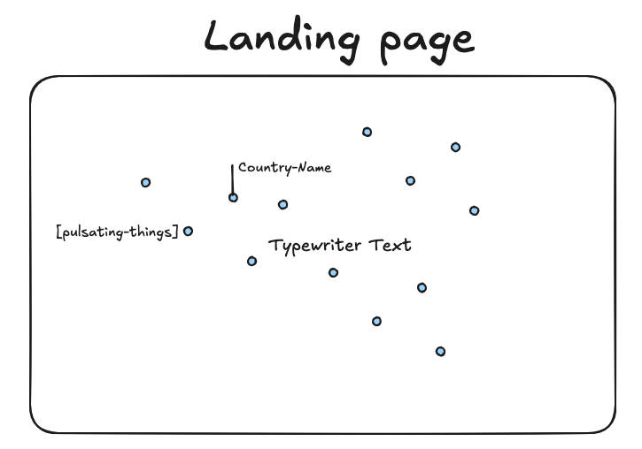
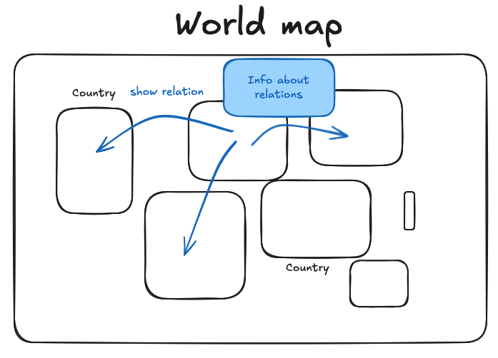
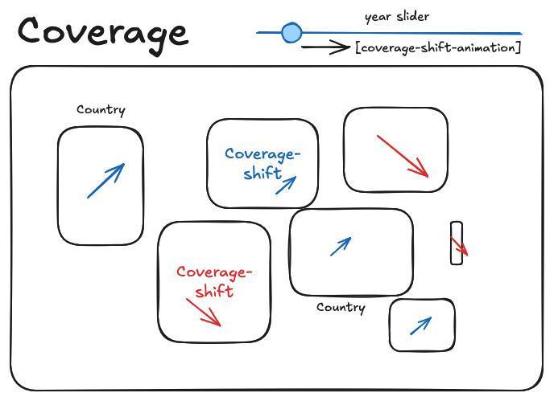
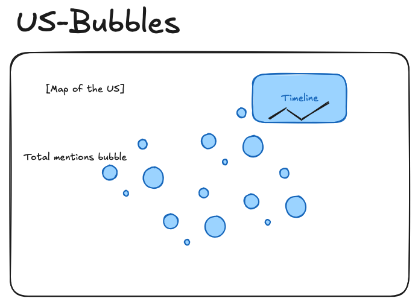

# Milestone 2

## Project Goal

I visualize how the New York Times covers the world by analyzing geographic patterns across 2.2 million articles (2000-2023). The visualization offers different views that let users discover which countries dominate headlines, how coverage shifts over time, which countries are mentioned together, and where in the US the NYT reports from beyond New York City.

## Sketches

{ width=48% } { width=48% }

{ width=48% } { width=48% }

## Visualizations, Tools and Lectures

### 1. Co-occurrence Map (Core)

Animated world map drawing arc connections to the countries most frequently co-mentioned in the same articles. A side panel ranks the top co-mentioned partners with sparklines.

**Tools**: D3.js (d3-geo, d3-transition), TopoJSON\
**Lectures**: Maps, Graphs, Do and Don't in Viz

### 2. Front Page Trend Map (Core)

World map with two modes: trend arrows (blue=increasing, red=decreasing coverage over 2000-2023) and a year heatmap with a slider that scrubs through years. Hovering a country cycles actual NYT headlines via typewriter animation.

**Tools**: D3.js (d3-geo, d3-transition, d3-scale), TopoJSON, SVG markers\
**Lectures**: Maps, Graphs, Storytelling

### 3. US City Bubble Map (Core)

Sqrt-scaled bubbles at each city mentioned in NYT datelines, projected onto the world map with smooth viewBox zoom into the US. Metro sub-zooms into NYC, LA, and SF. Sparkline tooltips show article counts over time.

**Tools**: D3.js (d3-geo, d3-scale), TopoJSON (US states)\
**Lectures**: Maps, Graphs, Do and Don't in Viz

### 4. Background Dot Map + Typewriter Effects (Extra)

Fixed SVG overlay on the landing page with animated dots spawning at random country locations. Typewriter effect on all titles with typo simulation.

**Tools**: D3.js, CSS animations, IntersectionObserver\
**Lectures**: Storytelling, Do and Don't in Viz

## Implementation Breakdown

### Core Visualization (MVP)

1. **Co-occurrence map** with hover-triggered arcs, connection panel with sparklines
2. **Front page trend map** with trend/year toggle, year slider, headline tooltips
3. **US city bubble map** with viewBox zoom, metro sub-zooms, sparkline tooltips
4. **Preprocessing pipeline** converting 2.2M articles into lightweight JSON via SQLite

### Extra Features

5. **Headline typewriter tooltips** cycling real NYT front page headlines
6. **Background dot map** with spawn pings and ambient animation
7. **Typewriter section titles** with typo simulation and cursor fade
8. **Scroll-driven mode cycling** with wheel interception and mobile touch support
9. **Mobile support** with touch swipe and tap interactions

## Functional Prototype

The website is live with all core and extra features implemented. All visualizations are interactive and the preprocessing pipeline processes 2.2M articles.
